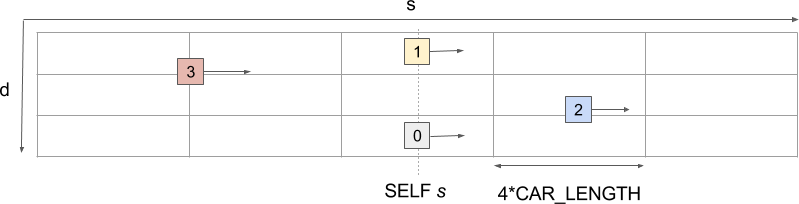
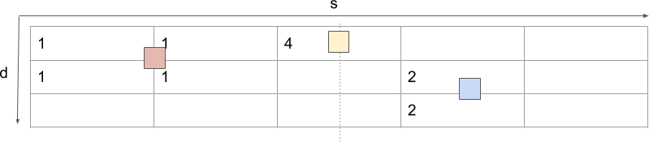
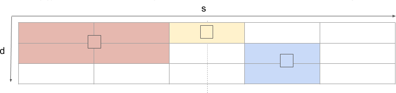

Project Reflections
-------------------

Author: Roman Stanchak

Course: Self-Driving Car Engineer Nanodegree Program Term 3

Date: November, 26 2017

## The Model

There are three major components to my path planner:

1. Reference lane computation
2. Reference velocity computation
3. Trajectory generation 

### Reference lane computation

The lane planner uses a simple state-machine containing two states as below:

1. KEEP_LANE
2. CHANGE_LANE

The transitions conditions are as follows:

- KEEP_LANE => CHANGE_LANE: a lane change is safe and gets the vehicle to its destination faster
- CHANGE_LANE => KEEP_LANE: the current lane matches the reference lane, i.e. the lane change is complete

#### calcBestLane algorithm
To determine the optimal lane, the function *calcBestLane* in PathPlanner.cpp analyzes the sensor fusion data as follows:

_1. Discretize the road area in Frenet coordinates into a grid_

In the s x d dimensions. Each d bin corresponds to a lane on the road, while each s-bins corresponds to 4 GM Hummer-sized car lengths (about 20 meters);

For each vehicle in the sensor fusion data, compute the bounding box in Frenet coordinates

_2. Compute the vehicle occupancy grid_

occ(i,j) = sum of vehicle bounding points contained inside cell i,j

_3. Compute the velocity grid_

vocc(i,j) = minimum velocity of all vehicles with a point inside cell i,j

 

_4. Compute the minimum lane velocity_

For each grid cell in front of the vehicle, compute the minimum velocity by lane and store this in the variable *vlanes*

_5. Determine the 'best lane'_

The best lane is chosen as the one with the maximum minimum velocity which is not occupied and which is adjacent to the current lane

### Reference velocity computation

The reference velocity refers to the velocity value used to compute the path points.  In meet physical, law and comfort limits, this reference velocity is only modified in increments of *max_acceleartion x dt* at every update iteration.

The target velocity refers to the eventual velocity, and corresponds to the lower of (a) the speed limit or (b) the velocity of the vehicle blocking the lane.

The target velocity is computed using *vlanes[current_lane]* from the *calcBestLanes* function, capped by the speed limit.

### Trajectory generation

This code computes a smooth trajectory based on the past trajectory, the reference lane, reference velocity and map waypoints.

The basic approach is as follows:

1. Select 5 reference points through which to fit a polynomial spline: one point behind the vehicle, one point at the vehicle origin and the 3 nearest map way points in the reference lane.
2. Fit a spline through these points
3. Extend the previous trajectory to contain exactly 50 points starting 

